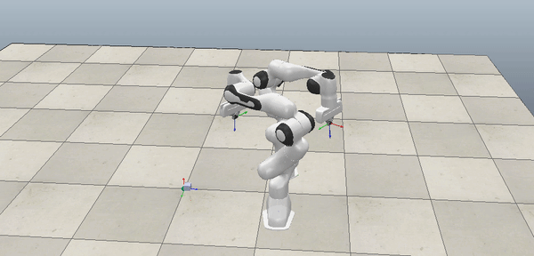

# Bimanual-Manipulation
Programming two Franka Panda robot arms to achieve collaboration in CoppeliaSim (aka V-REP) v4.3. The scripts for the robots are written in Lua.

## Tasks
### End-Effector Trajectory Planning
**Goal:** Grasp a cuboid and alternate the grasp between the two arms without collision

**Simulation:**

### Object Manipulation
**Goal:** Follow a pre-determined trajectory while holding the cuboid with both robot arms. 

**Simulation:**

## Setup
The simulations were prepared with CoopeliaSim V4.3. The API has significant changes in contrast to earlier versions. Using earlier versions would lead to errors.
## Reproducing the results
In order to reproduce the results, simply load the corresponding scene (`*.ttt`file) in CoppeliaSim and run the simulation by pressing the play button in the user interface.
